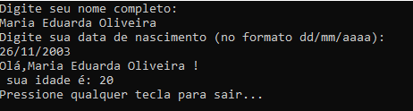

# Checkpoint 1 - Programa do tipo Console para calcular idade

Nossa equipe desenvolveu esse programa em linguagem C# do tipo Console que tem como principal objetivo calcular a idade de um usuário com base na data de nascimento inserida por ele via Console.

## Integrantes

- Isadora Tatajuba Moreira Pinto - RM552522
- Kaique Santos de Andrade - RM99562
- Lucas Araujo Oliveira Silva - RM550841
- Marcelo Augusto de Mello Paixão - RM99466
- Maria Eduarda Sousa de Oliveira - RM552477
- Rodrigo Batista Freire - RM99513


## Como funciona?

Inicialmente, por meio do método Main é solictado ao usuário seu nome completo, o qual é armazenado em uma variável ao ler o dado inserido pelo mesmo.

Em seguida, é solicitado ao usuário sua idade, no formato "dd/mm/aaaa". Após a leitura e armazenamento da variável dt_nascimento, é feita uma tentativa de converter o valor inserido (inicialmente, armazenado como String) para o formato DateTime, utilizando o TryParseExact(), obtido por meio da utilização do namespace System.

````
if (DateTime.TryParseExact(dt_nascimento, "dd/MM/yyyy", null, System.Globalization.DateTimeStyles.None, out dataNascimento))
{
    int idade = CalcularIdade(dataNascimento);
    Console.WriteLine("Olá, " + nome + "! Sua idade é: " + idade + " anos.");
}
else
{
    Console.WriteLine("Entrada inválida. Por favor, insira uma data válida no formato dd/mm/aaaa.");
}

````

Caso não seja possível realizar a conversão, ou seja, o usuário digitar em um formato inválido, é exibida uma mensagem de erro e a possibilidade de interromper a execução do programa por meio do ReadKey().

````
 Console.WriteLine("Pressione qualquer tecla para sair...");
 Console.ReadKey();

````

Dessa forma, ao converter o valor recebido para o formato correto, torna-se possível realizar as operações para calcular a idade do usuário, considerando a data atual do sistema, no método criado CalcularIdade().

Neste método é realizado também a conferência se o usuário já fez aniversário no ano atual, utilizando o método AddYears.

````
static int CalcularIdade(DateTime dataNascimento)
{
    DateTime dataAtual = DateTime.Today;
    int idade = dataAtual.Year - dataNascimento.Year;

    // Verificar se já fez aniversário neste ano
    if (dataNascimento > dataAtual.AddYears(-idade))
    {
        idade--;
    }

    return idade;
}

````

Por fim, o programa retorna no console uma saudação ao usuário com seu nome informado inicialmente, com a sua idade como na imagem:




